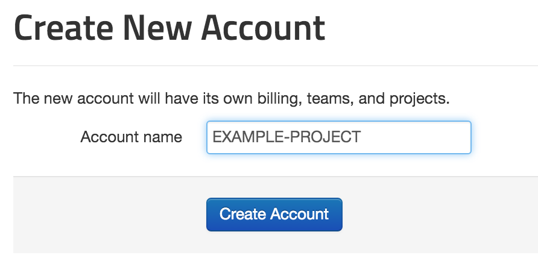
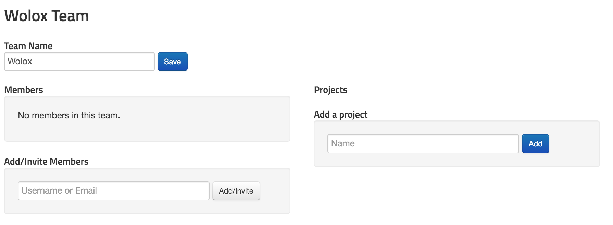

Frontend Kickoff guide
-----------------

The following guide explains how to make a frontend project kickoff from scratch. Depending on who is making the kickoff, it may lack access to execute some steps from this guide. In that case, get in touch with someone that can grant those access. They can be granted by [TMS](mailto:tms@wolox.com.ar), [TLS](mailto:tls@wolox.com.ar) or [Santiago Samra](mailto:santiago.samra@wolox.com.ar).

The Technical Leaders of the frontend department can help you with the steps from this guide or grant you the necessary access needed. Any doubt get in touch with:

 * [Gabriel Zanzotti](mailto:gabriel.zanzotti@wolox.com.ar)
 * [Sebastian Balay](mailto:sebastian.balay@wolox.com.ar)

## Requirements

Before you start with this step by step guide you will need the following:
  * Access to the Github repository where the code of the kickoff will be. If the repository is not created ask the TM from this project for it.
  * Verify that the developers group email of the project is working. It should have the format: `PROJECT_NAME-dev@wolox.com.ar`. You can ask the TM from this project to create the email team.

## Kickoff

The following steps will help you have a frontend project ready for new features.

### Clone and project base setup

#### Adding base project

The first thing you need to do is to clone the base project we have at Wolox that includes many of the common tools we use everyday, in almost every project.

For this open your terminal and execute:

  ```bash
    git clone git@github.com:Wolox/frontend-bootstrap.git example-project
    cd example-project
    rm -rf .git
    git init
    git remote add origin git@github.com:Wolox/example-project.git
  ```

**Remember to use the `angular` branch of the frontend bootstrap if it's an angular project**

Then you need to run the script that changes all the names of the base project to the one you really want. Run:
Remember to follow the steps detailed in the frontend bootstrap readme to install node if you still do not have it.

  ```bash
    node script/bootstrap
  ```

This will properly rename the bootstrap files to match the project name.

Now you are ready to commit the Initial Commit code by running:

  ```bash
    git add .
    git commit -m "Initial commit"
    git push origin master -f
  ```

## Wolox CI

Ask your technical leader to properly setup the continous integration environment

## Rollbar

When the projects is deployed to Stage or Production it will need a dashboard to show all the exceptions raised. For this we use [Rollbar](https://rollbar.com/).

### Create account

First we need to create an account that will have all the tecnologies of the project. Enter [here](https://rollbar.com/account/create/) and insert `EXAMPLE-PROJECT`.



### Create Wolox Team.

Enter [https://rollbar.com/settings/accounts/EXAMPLE-PROJECT/teams/](https://rollbar.com/settings/accounts/EXAMPLE-PROJECT/teams/) replacing `EXAMPLE-PROJECT` with your new account name. Press `New Team` and enter `Wolox`. In the following page add all the developers that need access:



Go back to the `Owners Team` and add the TM email.

### Create Project

Now let's add the new frontend project. Enter [https://rollbar.com/settings/accounts/EXAMPLE-PROJECT/projects/](https://rollbar.com/settings/accounts/EXAMPLE-PROJECT/projects/) replacing `EXAMPLE-PROJECT` with your new account name. Delete the `FirstProject` that its always added by default and then under `Create a new project` insert your project name in Camel-Case separated by `-`, and assign `Wolox` as a team. Don't forget to add the technology at the end of the name of the project. This will make the emails more clear.


### Notify TM

Now that your Kickoff is ready. Notify the TM about this by email. The TM should ask [Santiago Samra](mailto:santiago.samra@wolox.com.ar) to grant access to the developers to the Github Repo.
