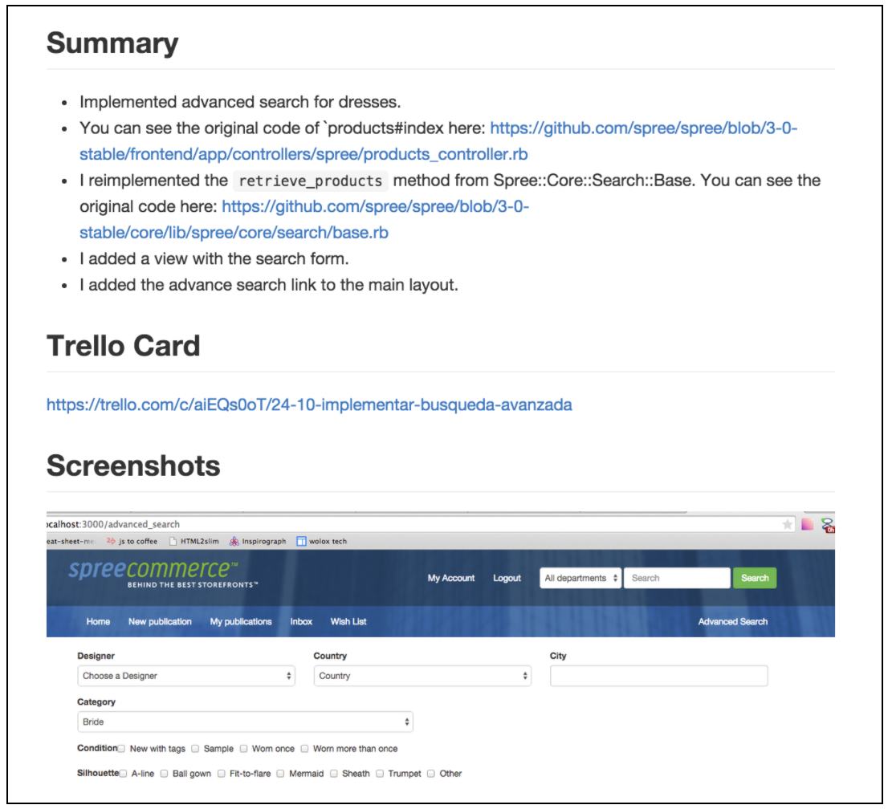
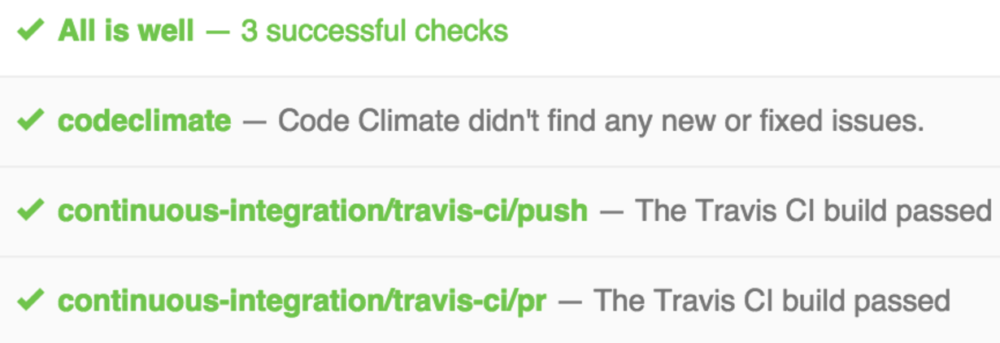

# Wolox Good Practices for Github Pull Requests

It's important to take into account these good practices to create Github Pull Requests. Creating good pull requests helps us to keep high code quality and to avoid bugs in our code.

A good pull request will look something like this:

When you are going to create a pull request take into account:

- Read [this link](https://help.github.com/articles/using-pull-requests/) to create a pull request.
- All the pull request content must be in english.
- A Pull request should be a small feature. Usually if a Pull request has more than 20 files changed then you may be adding lots of functionalities, and so could divide them into separate PRs.
- A Pull request is a good place to discuss, ask and suggest improvements, that's the best way to learn and to improve your code.

## Pull Request Content

You should have a `pull_request_template.md` template in the project's repository.
It should be placed in `docs` filer, or `.github` folder if you want it "hidden". You can check [this](https://help.github.com/articles/creating-a-pull-request-template-for-your-repository/) link.
The template should be based on [this example template](./pull_request_template.md) and modified according to project.

## Example

- You should analyze before starting your pull request which functionalities you are adding and consider dividing it in different small pull requests.
- Commits messages should be descriptive. Having a commit with the message: “Some fixes” it not descriptive, “Fixing products display in dashboard” is much better.
- When a pull request needs many fixes, you may end up finishing with lots of unnecessary commits. If you want to clean those commits you can squash them. Remember that if you use the git squash feature, you will need to push with --force and this is a bad idea when people are using your branch as a base branch for another feature (use --force-with-lease instead of --force).
- Build should be SUCCESS. If the repository includes continuous integration services like Travis, Wolox CI, then the build of the pull request should be success.

- You can set up git hooks to avoid forgetting to run tests and linters locally before you push your code.
- You should add tests every time you add new functionalities.
- Delete your branch after merging your pull request. You can do this from the same page you merge your branch.
- Before assigning a reviewer to the PR, you should check all the items described in this document. Looking at your own code is a good way to avoid silly errors like living a debug breakpoint.
- You shouldn’t upload secret credentials.

### When is a Pull Request ready to get merged?

A pull request is ready to be merged after the following two steps:

- All builds are SUCCESS.
- **Code review**: After creating a pull request, it must be assigned to a code reviewer using the `assignees` and `reviewers` field. The code reviewer will check the code and may comment, request changes or approve. The pull request is approved when there are no more changes requested and at least one code reviewer marks it as Approved. If the code reviewer requests changes, he will assign you and then you should generate new commits with the fixes requested. **Never modify old commits** because the code reviewer will use the diff to compare new changes. Don’t forget to assign the reviewer back after you make all the fixes.
