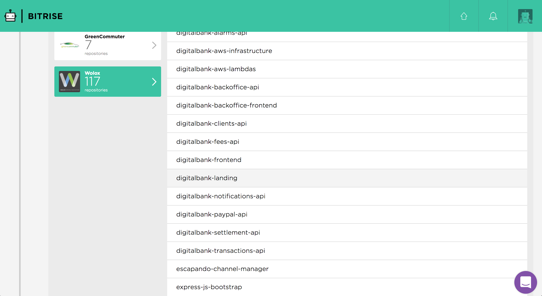
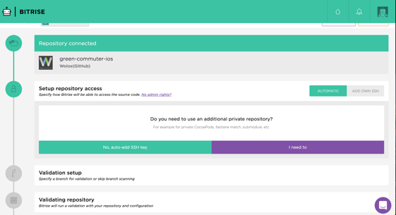
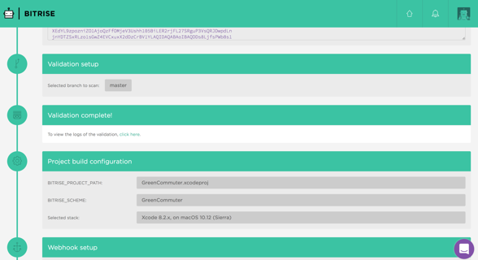
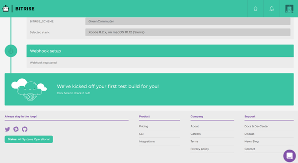
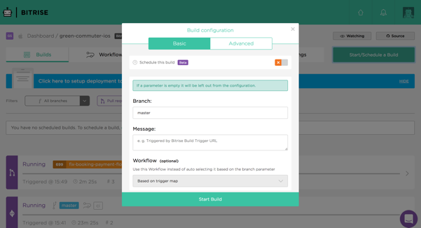

CI configuration for iOS projects
-----------------

This is a tutorial explaining how to configure continuous integration for iOS projects from scratch. Some steps can't be followed without being granted access to certain services: request them to an iOS' technical leader:

* [Pablo Giorgi](mailto:pablo.giorgi@wolox.com.ar)
* [Guido Marucci Blas](mailto:guidomb@wolox.com.ar)

The following steps will guide you to setup a new project in [Bitrise](https://bitrise.io). Note that this guide is intended for standard projects, so if any custom configuration is needed some steps may change.

## Check repo files...

### Check the repository’s `bitrise.yml`.

It can be found [here](https://github.com/Wolox/ios-base-project/blob/master/bitrise.yml) in the `ios-base-project` root directory.

Replace `REPO_SLUG`, `BITRISE_PROJECT_PATH` and `BITRISE_SCHEME` values with your app’s values.
Keep in mind that the bitrise steps versions may be outdated, so check the [latest versions](https://github.com/bitrise-io/bitrise-steplib/tree/master/steps) inside each steps folder and update the file accordingly. Example: if `bitrise.yml` contains a step `script@1.1.3`, check in that folder, in the step `script` if `1.1.3` is the latest version.

Our bitrise scripts will use [Fastlane](https://github.com/fastlane/fastlane), this gem is already added in the [Gemfile](https://github.com/Wolox/ios-base-project/blob/master/Gemfile). You can run `fastlane init` to initialize Fastlane with a basic configuration.

## Check configuration files encryption...

This step is optional and only useful if you need to encrypt files to be used in Bitrise. As long as you use CI only for compiling and running tests, this step will not be necessary. Instead, if you configure CI for building the application (for example for distribution) you will need to upload the encrypted `.xcconfig` files.

The provided `bitrise.yml` is not configured for encryption, so in case your project requires it follow these steps:

### Encryption

If you need to use any secret configuration keys in the Bitrise build, encrypt the `.xcconfig` files with those keys.

```
# Put all the files in a tar file
tar cvf secrets.tar file1 file2

# Encrypt the tar file
openssl aes-256-cbc -k "password" -in secrets.tar -out secrets.tar.enc
```

### Decryption

Add this as first step of the `bitrise.yml`:

```
    - script@1.1.3:
        title: Decrypting files...
        inputs:
        - content: openssl aes-256-cbc -k "$ENCRYPT_PASSWORD" -in secrets.tar.enc -out secrets.tar -d && tar xvf secrets.tar
```

Don’t forget to include `ENCRYPT_PASSWORD` as explained in [Configure App Environment variables](#configure-app-environment-variables)

## Create Bitrise app...

### Log in to [Bitrise](https://www.bitrise.io/) using your Wolox's github account.

If you’re not added to the `Wolox` organization, you should ask the technical leader to do so.

### Add application

In Bitrise dashboard, press "Add new app" to start the process.

### Choose project’s repository

Before starting, make sure `Wolox` is selected in the "Add new app to" option in top left.


From the list of platforms, choose `Github`. Below, in the left part of the screen you can see a list of github organizations you contribute to. Choose `Wolox` (or the organization the repository is under), and then at the right choose the repository you want to integrate.



### Setup repository access

Select `auto-add SSH Key`. The key should be added automatically after a moment. If it doesn’t work, you may need to do it manually.

NOTE: Only Github admins can automatically add the SSH key in this step. In case you have no access, skip this step and ask your TL to do it.



### Validation setup

Choose the main branch of your project (master or development usually). Bitrise will scan the branch to check for the correct configurations. This takes about 5 minutes.

### Project build configuration

Select iOS. Verify that the correct XCode stack is selected and confirm.



### Webhook setup

Please note this can only be done by a repository administrator.

Select "Register a new webhook for me". It will allow Bitrise to know when a `push` / `pull request` has been made, so it can test it.

It can be done from the Code tab in the project’s dashboard. Under “webhooks”, there’s a webhook URL which you can add to your Github repository following [this guide](https://github.com/bitrise-io/bitrise-webhooks#github---setup--usage).

### Finish configuration

Select "We’ve kicked off your first test build for you!" to continue. Bitrise will run a build at this step, you should cancel it since it runs with another configuration, thus it will fail.



## Configure Bitrise’s `bitrise.yml`

When Bitrise builds trigger, they look for the configuration in the web’s `bitrise.yml`. This file should call the one from our repository.

For this, go to `Workflow`, inside the project's bitrise page. There select `bitrise.yml` and replace the contect of the file for this:

```
format_version: 1.4.0
default_step_lib_source: https://github.com/bitrise-io/bitrise-steplib.git
trigger_map:
- push_branch: master
  workflow: ci
- pull_request_source_branch: "*"
  pull_request_target_branch: "*"
  workflow: ci
workflows:
  _run_from_repo:
    steps:
    - activate-ssh-key@3.1.1:
        run_if: '{{getenv "SSH_RSA_PRIVATE_KEY" | ne ""}}'
    - git-clone@3.4.1: {}
    - script@1.1.3:
        title: Extracting Bitrise configuration from repo
        inputs:
        - content: |-
            #!/bin/bash
            set -ex
            bitrise run "${BITRISE_TRIGGERED_WORKFLOW_ID}"
  ci:
    after_run:
    - _run_from_repo
    steps:
```

## Configure App Environment variables

From the menu on the left, select `App Env Vars` for private repositories or `Secret Env Vars` for public ones. Add the keys and values of the environment variables that will be needed for bootstrapping, testing and all other actions or steps that will be run according to the repo's `bitrise.yml`.

If you don't know what these Env Vars are, ask your TL to give you access to them. Just as reference, the variables you will need to set are:

```
- GITHUB_ACCESS_TOKEN
- KEY_PASSWORD
- CARTHAGE_CACHE_BUCKET_NAME
- AWS_REGION
- AWS_ACCESS_KEY_ID
- AWS_SECRET_ACCESS_KEY
- RUNNING_ON_CI
```

To have `codestats` reporting in your project, first ask an administrator to add the project to codestats and add both the `CODE_STATS_TOKEN` and `CODE_STATS_URL` of the project as an environment variable.

## Run build manually

To check that everything works correctly, you should run a build manually in your default branch.



For this, go to `Start / Schedule a build`, inside the project's bitrise page. Select your default branch and confirm.

**Important**: if your build fails because of a module that's missing (`no such module '<ModuleName>'` error, for example), there's a big chance it's related with `carthage_cache`. To solve this:
* Check that you have your `carthage_cache` properly set up. If not, go through the setup process described in [its repo](https://github.com/Wolox/carthage_cache#setup).
* Try force-publishing a new build. You can easily do that with `carthage_cache publish --force`.

That will surely take care of these types of errors.

## Add bagdes to README

Badges for bitrise and codestats can be added from:

### bitrise:

Go to the project in bitrise and tap on the badge next to the project's name:


In the new window that opens, select format `Markdown` and copy the "Embed" content. Paste this in the project's README badges section.

### codestats:

Paste this in the project's README badges section.

```
[](http://codestats.wolox.com.ar/organizations/wolox/projects/project-name/badge)
```

Replace `project-name` with your project's repository name.
