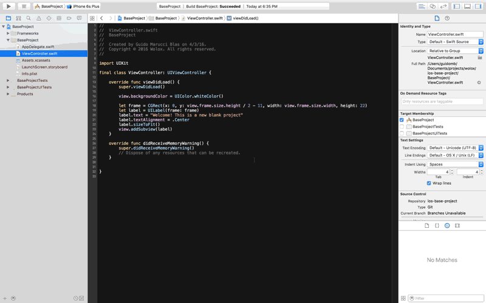
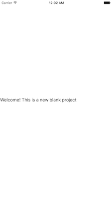
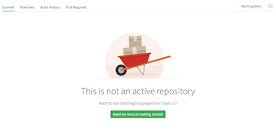
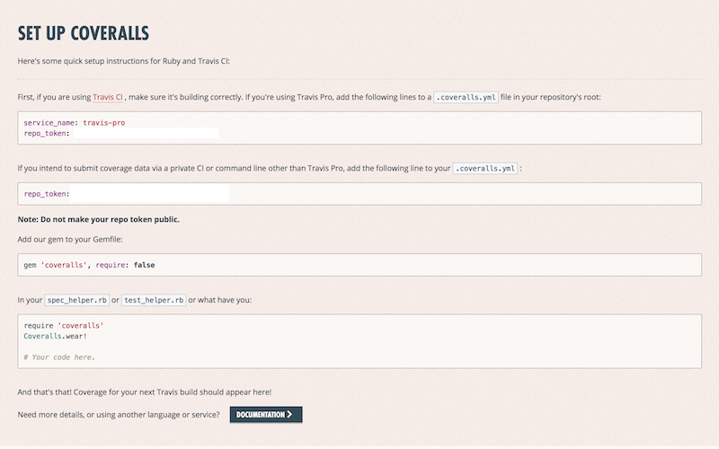
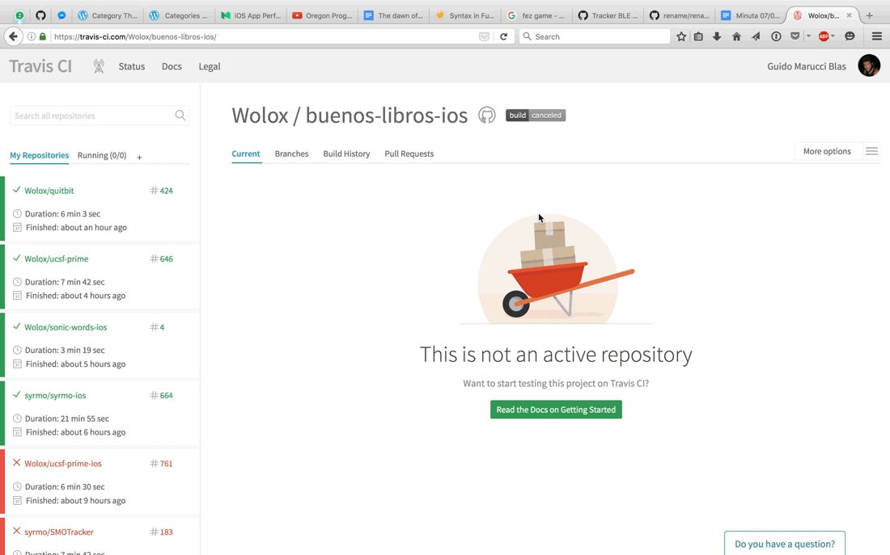
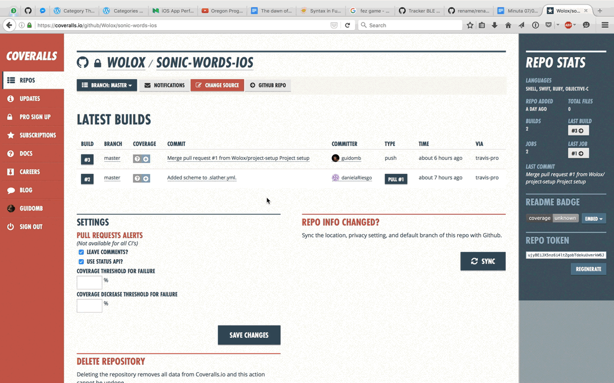

iOS Kickoff guide
-----------------

El siguiente es un tutorial que explica como hacer el kickoff de un proyecto de iOS desde cero. Dependiendo de quien este haciendo el kickoff puede ser que algunos pasos no los pueda realizar al no tener los accesos necesarios a ciertos servicios. De ser así, comunicarse con alguien que sí tenga acceso. En general los TMs, TLs o [Santiago Samra](mailto:santiago.samra@wolox.com.ar) pueden darle acceso o activar cualquier servicio necesario.

Los technical leaders del departamento de iOS tambien tiene acceso a todos los servicios necesarios para poder hacer un kickoff. Cualquier duda consultar con ellos:

 * [Pablo Giorgi](mailto:pablo.giorgi@wolox.com.ar)
 * [Guido Marucci Blas](mailto:guidomb@wolox.com.ar)

## Pre-requisitos

Antes de poder empezar con el proceso de kickoff de un proyecto iOS es necesario tener:

 * Acceso al repositorio de GitHub
 * Corroborar que la cuenta de email grupal esté funcionando. La cual tiene el siguiente formato: `PROJECT_NAME-dev-ios@wolox.com.ar`
 * El repositorio debe estar dado de alta en [TravisCI](https://travisci.com). Si la URL del proyecto en GitHub es `http://github.com/Wolox/example-project-ios`, la URL del proyecto en TravisCI debe ser `http://travisci.com/Wolox/example-project-ios`
 * El repositorio debe estar dado de alta en [Coveralls](https://coveralls.io). Si la URL del proyecto en GitHub es `http://github.com/Wolox/example-project-ios`, la URL del proyecto en Coveralls debe ser `https://coveralls.io/github/Wolox/example-project-ios`
 * Corroborar que se tenga acceso al board de Trello del proyecto.
 * Corroborar que se tenga acceso al Google Drive del proyecto.
 * Asegurarse que el usario `wolox-ci` en GitHub tenga acceso de escritura al repositorio.
 * Asegurarse tener las credenciales de acceso de Amazon S3 para poder configurar [CarthageCache](https://github.com/guidomb/carthage_cache).
 * Tener instaldo Xcode y las Xcode command line tools.
 * Tener instalado git y [Homebrew](https://brew.sh).
 * Tener instalado [rbenv](https://github.com/rbenv/rbenv).

 
## Kickoff

Los siguientes pasos sirven para poder configurar un nuevo proyecto de iOS. Para eso vamos a basarnos en un proyecto de ejemplo el cual se llama `Example Project` (muy original). Usted deberá remplazar todas las referencias de example project por el proyecto correspondiente. Es muy importante que respecte las convenciones de nombre según corresponda. Es decir si ve que hay que usa camel case notation, respete la notación. Por ejemplo si debemos actualizar el nombre del archivo `BaseProject.xcodeproj` con el nombre de nuestro proyecto, en este caso example project, el archivo se debe llamar `ExampleProject.xcodeproj`. Simplemente siga el patrón de nombres que está en el base project.

### Clone & setup del proyecto

#### Agregar proyecto base

Lo primero que debemos hacer es clonar el repositorio base el cual ya está pre-configurado con la configuración básica que require cualquier proyecto iOS. Esto incluye las dependencias más comúnes y configuracioens de Xcode básicas que necesita cualquier proyecto. Para esto abra una terminal y ejecute el siguiente comando

	git clone git@github.com:Wolox/ios-base-project.git

Luego debemos clonar el repositorio vacío para el proyecto `Example Project` cuya URL en GitHub es `https://github.com/Wolox/example-project-ios` y la URL para poder usar el protocolo ssh es `git@github.com:Wolox/example-project-ios.git`. En la misma terminal donde ejecutó el comando anterior, ejecute

	git clone git@github.com:Wolox/example-project-ios.git
	rsync -av --progress ios-base-project/. example-project-ios --exclude .git
	cd example-project-ios
	git add .
	git commit -m "Initial commit"
	git push origin HEAD -u
	
Una vez subidos estos cambios a GitHub debemos crear una nueva branch para hacer el setup del proyecto. Esto es importante ya que al finalizar debemos hacer un pull request con toda la configuración para asegurarnos que el [TravisCI](https://travisci.com) y [Coveralls](https://coveralls.io) están funcionando.
	
	git checkout -b "project-setup"
	
#### Renombrar proyecto	
	
Una vez agregado los archivos iniciales del proyecto base al repositorio se debe proceder a renombrar el proyecto. Para esto abrá el proyecto con Xcode ejecutando el siguiente comando.

	open BaseProject.xcodeproj

Luego cambiele el nombre de `BaseProject` a `ExampleProject` siguiendo los pasos mencionados en el [este](https://developer.apple.com/library/ios/recipes/xcode_help-project_editor/RenamingaProject/RenamingaProject.html) tutorial.

Luego se debe renombrar el scheme ya que este no cambió en proceso anterior. Para esto hay que duplicar el scheme actual, cambiandole el nombre y luego borrar el scheme anterior. Recuerde tildar la opción que dice `shared` ya que es necesario para que se pueda buildear el proyecto en el ambiente de CI.



Finalmente debemos renombrar las carpetas y los grupos para esto podemos ejecutar los siguientes comandos (remplazando `ExampleProject` por el nombre de su proyecto)

	brew install rename ack
	find . -name 'BaseProject*' -print0 | xargs -0 rename -S 'BaseProject' 'ExampleProject'
	ack --literal --files-with-matches 'BaseProject' | xargs sed -i '' 's/BaseProject/ExampleProject/g'
	
Para verificar que todas las ocurrencias de `BaseProject` hayan sido renombradas el siguiente comando debería no devería imprimir output
	
	ack --literal 'BaseProject'

#### Configurar build scripts

Una vez renombrado el proyecto debemos actualizar el archivo de configuración de los [build scripts](https://github.com/guidomb/ios-scripts). Para esto se debe editar el archivo `script/.env` el cual debería tener el siguiente contenido

```
REQUIRED_SWIFTLINT_VERSION=0.9.2
REQUIRED_CARTHAGE_VERSION=0.15.1
CARTHAGE_BUILD_PLATFORM=${CARTHAGE_BUILD_PLATFORM:-"iOS"}
CARTHAGE_NO_USE_BINARIES=${CARTHAGE_NO_USE_BINARIES:-"false"}
LINT_PODSPEC=${LINT_PODSPEC:-"yes"}
PROJECT_NAME=BaseProject
XCODE_WORKSPACE=
XCODE_PROJECT=BaseProject.xcodeproj
IOS_DESTINATION_VERSION=${IOS_DESTINATION_VERSION:-"latest"}
IOS_DESTINATION_SIMULATOR_NAME=${IOS_DESTINATION_SIMULATOR_NAME:-"iPhone 6"}
OSX_DESTINATION_ARCH=${OSX_DESTINATION_ARCH:-""}
INSTALL_GITHOOKS=true
```

Se deben cambiar las variables `PROJECT_NAME` y `XCODE_PROJECT` las cuales deben tener los siguiente valores

```
PROJECT_NAME=ExampleProject
XCODE_PROJECT=ExampleProject.xcodeproj
```

Una vez hecho esto se debe ejecutar el script de bootstrapping el cual se encarga de instalar todas las dependencias necesarias para poder ejecutar el proyecto. Entre ellas configurará de forma local las credenciales necesarias para poder usar [CarthageCache](https://github.com/guidomb/carthage_cache) y generar el archivo `.carthage_cache.yml`. Deberá tener a mano el access key ID y el secret access key de la cuenta de AWS que tiene acceso al bucket `carthage-cache`. La región de AWS a utilizar es `us-west-2`. Una vez que tenga a mano las crendenciales de AWS ejecute el siguiente comando

	script/bootstrap
	
Luego de ingresar la crendenciales de AWS y luego de que se instalen todas las dependencias, debería ver el siguiente mensaje en la terminal.

```
 ExampleProject successfully bootstrapped

 Usefull scripts:

  * 'script/test' to run tests.
  * 'script/build' to build the project.
  * 'script/update' to update project's dependencies.

 You can start hacking by executing:

    open ExampleProject.xcodeproj

```

#### Configurar SwiftLint

Para configurar [SwiftLint](https://github.com/realm/SwiftLint) se debe editar el archivo `.swiftlint.yml` el cual debería tener el siguiente contenido

```yaml
disabled_rules: # rule identifiers to exclude from running
  - trailing_whitespace
excluded: # paths to ignore during linting. overridden by `included`.
  - Carthage
  - BaseProjectTests
  - BaseProjectUITests
line_length: 200
function_body_length: 20
```

Solo debemos remplazar `BaseProjectTests` por `ExampleProjectTests` y `BaseProjectUITests` por `ExampleProjectUITests`.


#### Agregar cambios al repositorio

Aseguresé que el proyecto compila y ejecútelo en el simulador (⌘ + R). Debería ver la siguiente pantalla.



Finalmente agregamos estos cambios en el repositorio ejecutando los siguientes comandos

	git add .
	git commit -m "Project rename"

### Configurar TravisCI

Lo siguiente a configurar es el servicio de integración continua. En este caso TravisCI. Primero debemos asegurarnos que el repositorio fue dado de alta en Travis. Asegurese que al entrar a la URL del proyecto en Travis (`httsp://travis.com/Wolox/example-project-ios`) aparece la siguiente imagen



Para poder configurar travis debemos abrir el archivo `.travis.yml` que se encuentra en la raíz del proyecto. El cual debería tener el siguiente contenido

```yml
language: objective-c
osx_image: xcode7.3
before_install:
- gem install bundler
script:
- REPO_SLUG="$TRAVIS_REPO_SLUG" PULL_REQUEST="$TRAVIS_PULL_REQUEST" DISABLE_SWIFTLINT_RUN_SCRIPT=true FORCE_CARTHAGE_VERSION=true script/cibuild
after_success: bundle exec slather
branches:
  only:
  - master
env:
  global:
notifications:
  email:
    - baseproject-ios-dev@wolox.com.ar
```

Lo primero a cambiar es es la dirección de email al cual se enviarán todas las notificaciones de travis. Esta debe estar aputando a la dirección del grupo de desarrollo del proyecto de iOS. Para esto se debe remplazar `baseproject-ios-dev@wolox.com.ar` por `example-project-ios@wolox.com.ar`. Luego debemos agregar las siguiente variables de entorno

 * `GITHUB_ACCESS_TOKEN`
 * `KEY_PASSWORD`
 * `AWS_REGION`
 * `AWS_ACCESS_KEY_ID`
 * `AWS_SECRET_ACCESS_KEY`
 * `CARTHAGE_CACHE_BUCKET_NAME`

Las credenciales de AWS son las mismas que usó para configurar [CarthageCache](https://github.com/guidomb/carthage_cache) en el proceso de bootstrapping.

`KEY_PASSWORD` es el passphrase del certificado de desarrollo de Apple que se usa para firmar las dependencias. Dicho certificado se encuentra en `script/certificates/cibot.p12`.

`GITHUB_ACCESS_TOKEN` es el access token generado para la cuenta `wolox-ci` (la cual debe tener acceso de escritura al repositorio).

Para agregar estas variables de entorno de forma encriptada primero debemos loguearnos en travis desde la linea de comandos usando el siguiente comando

	bundle exec travis --pro

Luego debemos agregar las variables encriptadas al archivo `.travis.yml` ejecutando los siguientes comandos, remplazando los valores que corresponda

	 bundle exec travis encrypt GITHUB_ACCESS_TOKEN=INSERTE_EL_ACCESS_TOKEN --add env.global
	 bundle exec travis encrypt KEY_PASSWORD=INSERTE_EL_KEY_PASSWORD --add env.global
	 bundle exec travis encrypt AWS_REGION=us-west-2 --add env.global
	 bundle exec travis encrypt AWS_ACCESS_KEY_ID=INSERTE_EL_ACCESS_KEY --add env.global
	 bundle exec travis encrypt AWS_SECRET_ACCESS_KEY=INSERTE_EL_SECRET_ACCESS_KEY --add env.global
	 bundle exec travis encrypt CARTHAGE_CACHE_BUCKET_NAME=carthage-cache --add env.global
	 
**IMPORTANTE!!!:** Es importante que ejecute estos comando un espacio en blanco al principio para que no queden guardados en el historial de su consola.

Una vez que se han agregado todas las variables de entorno debemos agregar estos cambios al repositorio

	git add .travis.yml
	git commit -m "Configures env variables for TravisCI."

### Configurar Coveralls & Slather

Lo siguiente a configurar es el servicio de code coverage. En este caso Coveralls. Primero debemos asegurarnos que el repositorio fue dado de alta en Coveralls. Asegurese que al entrar a la URL del proyecto en Coveralls (`httsp://coveralls.io/github/Wolox/example-project-ios`) aparece la siguiente imagen



Si la URL de Coveralls del proyecta muestra 404 pruebe entrando a [https://coveralls.io/refresh?private=true](https://coveralls.io/refresh?private=true) y espere a que se refresquen los proyectos o haga click en el boton "REFRESH PRIVATE REPOS".

Luego debemos editar el archivo `.slather.yml` el cual debería tener el siguiente contenido

```yaml
coverage_service: coveralls
xcodeproj: ./BaseProject.xcodeproj
scheme: BaseProject
ci_service: travis_pro
coverage_access_token: 
ignore:
  - BaseProjectTests/*
  - BaseProjectUITests/*
```

En la clave `coverage_access_token` debemos agregar el access token que figura en la página del proyecto en coveralls en la sección de set up bajo el nombre `repo_token`.

Luego debemos remplazar `BaseProject.xcodeproj` por `ExampleProject.xcodeproj`, `BaseProjectTests` por `ExampleProjectTests` y `BaseProjectUITests` por `ExampleProjectUITests`.

Una vez actualizado `.slather.yml` agregar los cambios al repositorio.

	git add .slather.yml
	git commit -m "Configures slather."

### Actualizar README.md

Una vez que el proyecto y todos los servicios estén configurados debemos actualizar el `README.md` con los datos del proyecto. Para esto debemos replazar todos las variables que empiecen con el caracter `%` por su valor correspondiente.

* `%project-name`: El nombre del repositorio, en este caso **Example project**.
* `%project-ci-badge`: El código Markdown para agregar el badge de TravisCI.
* `%project-coverage-badge`: El código Markdown para agregar el badge de Coveralls.
* `%project-description`: Una breve descripción del proyecto.
* `%pm-full-name`: El nombre completo del TM del proyecto.
* `%pm-email-address`: La dirección de email del TM del proyecto.
* `%tl-full-name`: El nombre completo del TL del proyecto.
* `%tl-email-address`: La dirección de email del TL del proyecto.
* `%project-trello-url`: La URL al board de Trello del proyecto.
* `%project-google-drive-url`: La URL a la carpeta de Google Drive del proyecto.
* `%project-git-ssh-url`: La URL de ssh de git del proyecto, en este caso **git@github.com:Wolox/example-project-ios.git**.
* `%project-root-directory-name`: El nombre de la carpeta raíz del proyecto, en este caso **example-project-ios**
* `%project-xcodeproj-file`: El nombre del archive de xcode del proyecto, en este caso **ExampleProject.xcodeproj**.

#### TravisCI badge

Para poder obtener el código markdown del badge de TravisCI el cual se debe poner en el `README.md` en la variable `%project-ci-badge`. Se debe entrar a la pagína de Travis del proyecto, hacer click en el badge que debería decir "build unknown" y en la ventana elegir *MARKDOWN* y copiar el snippet de código.



#### Coveralls code coverage badge

Para poder obtener el código markdown del badge de Coveralls el cual se debe poner en el `README.md` en la variable `%project-coverage-badge`. Se debe entrar a la pagína de Coveralls del proyecto, hacer click en el boton que debería decir "EMBED" en la columna derecha en la sección de readme badge y en copiar el snippet de código bajo el título que dice *MARKDOWN*.




Una vez actualizado el `README.md` se debe agregar este cambio al repositorio

	git add README.md
	git commit -m "Updates README.md."

### Enviar Pull Request

Finalmente debemos crear un pull request para subir todos los commits de la branch `project-setup` y checkear que los GitHub webhooks de TravisCI, [Linterbot](https://github.com/guidomb/linterbot) y Coveralls están funcionando.

Si ejecuta `git log` deberían aparecer los siguientes commits a pushear.

	Updates README.md.
	Configures slather.
	Configures env variables for TravisCI.
	Project rename.
	
Pusheamos estos commits a la branch `project-setup` y creamos un nuevo pull request en GitHub.

	git push origin HEAD -u	

Una vez que se ejecuten todos los webhooks deberíamos ver algo similar al siguiente screenshot en la sección de status


### Configurar GitHub

#### Protected branch

TODO

 * [Configuring protected branches](https://help.github.com/articles/configuring-protected-branches/)
 * [Enabling required status checks](https://help.github.com/articles/enabling-required-status-checks/)

#### Deshabilitar squash & merge

TODO

 * [Configuring pull request merge squashing](https://help.github.com/articles/configuring-pull-request-merge-squashing/)
